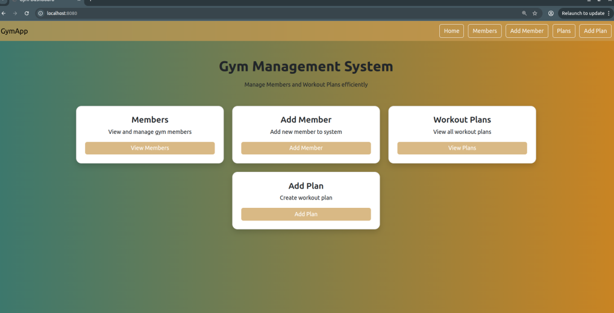

# gymProject
SGA2

# Gym Management System

A full-stack Gym Management System built using **Spring Boot**, **Thymeleaf**, **Spring Data JPA**, and **MySQL**. The application allows gym administrators to manage members and workout plans through a clean web interface.

---

## Features

### Member Management
- View all gym members
- Add new members
- Update member information
- Delete members
- Membership type selection (Basic/Premium)

### Workout Plan Management
- View workout plans
- Create workout plans
- Assign plans to members
- Track duration and difficulty

### User Interface
- Responsive dashboard
- Simple navigation
- Confirmation before deletion
- Clean Bootstrap-based design

---

## Tech Stack

| Technology | Purpose |
|------------|----------|
| Java 17 | Programming Language |
| Spring Boot | Backend Framework |
| Spring MVC | Web Layer |
| Spring Data JPA | Database Access |
| Hibernate | ORM |
| Thymeleaf | Template Engine |
| MySQL | Database |
| Bootstrap | UI Styling |
| Maven | Dependency Management |

---

## Project Structure

```
src
├── controller
├── entity
├── repository
├── service
├── templates
├── static
└── resources
```

---

## Getting Started

### Prerequisites

- Java 17+
- Maven
- MySQL

### Clone Repository

```bash
git clone https://github.com/ethicalcod/gymProject.git 
```

```bash
cd gymProject
```

### Configure Database

Create a MySQL database.

```sql
CREATE DATABASE gymdb;
```

Update your `application.properties`

```properties
spring.datasource.url=jdbc:mysql://localhost:3306/gymdb
spring.datasource.username=root
spring.datasource.password=yourpassword

spring.jpa.hibernate.ddl-auto=update
```

### Run Application

```bash
mvn spring-boot:run
```

Open

```
http://localhost:8080
```

---

# Screenshots

## Dashboard



---

## Members List


---

## Add Member


---

## Workout Plans


---

## Add Workout Plan


---

## Delete Confirmation


---

# CRUD Operations

| Module | Create | Read | Update | Delete |
|---------|:------:|:----:|:------:|:------:|
| Members | ✅ | ✅ | ✅ | ✅ |
| Workout Plans | ✅ | ✅ | (Can be added) | (Can be added) |

---

## Future Improvements

- User Authentication (Spring Security)
- Admin Login
- Search Members
- Pagination
- REST API
- Docker Support
- Member Attendance
- Payment Management
- Email Notifications

---

## Learning Outcomes

This project helped me gain practical experience with:

- Spring Boot
- MVC Architecture
- CRUD Operations
- Spring Data JPA
- Thymeleaf
- MySQL Integration
- Form Validation
- Bootstrap UI Design

---

## Author

**Shashi**

GitHub: https://github.com/ethicalcod
